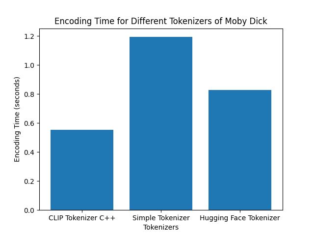

[](https://github.com/wirthual/clip_tokenizer_cpp/actions/workflows/test.yaml)

## C++ Implementation of CLIP tokenizer

Adapted from this [code](https://github.com/openai/CLIP/blob/main/clip/simple_tokenizer.py)


### Example Usage

```cpp
#include <iostream>
#include "tokenizer.h"

int main() {

    // Create a tokenizer instance
    SimpleTokenizer tokenizer;
    
    // Example usage
    std::string text = "CLIP is a is a multimodal vision and language model motivated by overcoming the fixed number of object categories when training a computer vision model. CLIP learns about images directly from raw text by jointly training on 400M (image, text) pairs. Pretraining on this scale enables zero-shot transfer to downstream tasks. CLIP uses an image encoder and text encoder to get visual features and text features. Both features are projected to a latent space with the same number of dimensions and their dot product gives a similarity score.";
    
    std::vector<int> tokens = tokenizer.encode(text);
    
    // Decode tokens back to text
    std::string decoded = tokenizer.decode(tokens);
    std::cout << "Decoded text: " << decoded << std::endl;
    
    return 0;
}

```
### Timing benchmark

Benchmark to tokenize Moby Dick.




### Verification test:

Test code in `python_test` folder in this repo.

Results:

Input: ```Hello, world! This is a test of the SimpleTokenizer.```


C++: Encoded tokens (14 tokens):
```3306 267 1002 256 589 533 320 1628 539 518 19018 32634 23895 269```


python: Encoded tokens: 
```[3306, 267, 1002, 256, 589, 533, 320, 1628, 539, 518, 19018, 32634, 23895, 269]```


python from hugging face: 
```[[3306, 267, 1002, 256, 589, 533, 320, 1628, 539, 518, 19018, 32634, 23895, 269]]```


### Use in your own CMake project

Clone this repo in e.g. `thirdpary` folder, then reference it in you CMake file like this:

Checkout
```bash
git clone --recursive https://github.com/wirthual/clip_tokenizer_cpp
```

Add it to your project:
```CMake

add_subdirectory(${PROJECT_SOURCE_DIR}/thirdpary/clip_tokenizer_cpp clip_tokenizer_cpp)

# Link libraries
target_link_libraries(my_app
    PRIVATE
    clip_tokenizer_cpp
)
```

